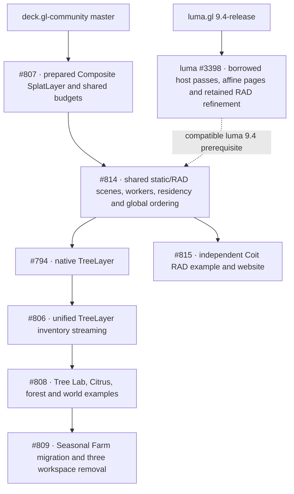

# TreeLayer, Composite SplatLayer and Coit stack

Revised October 7, 2026. Arrows show landing order; dashed arrows cross repositories.
The community stack branches above the shared SplatLayer runtime. Coit has no TreeLayer prerequisite; the tree chain ends with its own migration cleanup.

| PR | Base branch | Head branch |
| --- | --- | --- |
| [#807](https://github.com/visgl/deck.gl-community/pull/807) | `master` | `codex/tree-splat-canopy` |
| [#814](https://github.com/visgl/deck.gl-community/pull/814) | `codex/tree-splat-canopy` | `codex/splat-scene-foundation` |
| [#794](https://github.com/visgl/deck.gl-community/pull/794) | `codex/splat-scene-foundation` | `codex/native-tree-lab` |
| [#806](https://github.com/visgl/deck.gl-community/pull/806) | `codex/native-tree-lab` | `codex/tree-forest-performance` |
| [#808](https://github.com/visgl/deck.gl-community/pull/808) | `codex/tree-forest-performance` | `codex/citrus-tree-lab` |
| [#815](https://github.com/visgl/deck.gl-community/pull/815) | `codex/splat-scene-foundation` | `codex/coit-community` |
| [#809](https://github.com/visgl/deck.gl-community/pull/809) | `codex/citrus-tree-lab` | `codex/remove-three-module` |

## Implemented behavior

`SplatLayer` accepts direct prepared assets, URL/Blob/static/RAD descriptors, or owner rows with
constant/default/per-row `getSource`. The prepared weighted path retains TreeLayer wind, optical
refinement, materials and shadows. Sorted Cartesian scenes share source loading and source-page
uploads across owners, views and layers, with one order per view/domain and deck-owned rendering.
TreeLayer accepts supplied rows or `getTileData` inventory streaming with the same top-level tree
accessors. Its internal tile component handles traversal; WorldTreeLayer is a deprecated compatibility
wrapper. RAD workers retain native authored hierarchy and HTTP ranges. Coit uses the public built package,
bundled workers, authored FirstPerson camera and the real 50,937,127-row asset.

## Verification and landing boundaries

An isolated Coit checkout contains only #807 and #814; its public package, example and website
builds verify that no TreeLayer implementation is required. A local integration checkout combines
both PR branches for the full website and consumer checks.

The final checks include root install/build, strict public consumers, Coit strict types and camera
regressions, production Coit Vite build, website workspace install/build, full Node tests, and
WebGL2/WebGPU pixels for ordering, tint/affine ownership, picking, Blob decode and teardown.
Regression gates also cover retained light selections during asset removal, empty/singular sorted
domains, nested scene/prepared budget groups, distant-crown tile metadata, the wind pause clock,
and controls inside short Coit embeds.
Interrupted inventory replacements now restart contributing page fades from their current
weights on one interval per region, preserving coverage when a third page arrives without delaying
independent neighboring fades. Numeric
coverage accessors invalidate cached tree attributes without a manual trigger. Citrus shadow
toggles retain the last cycled sun direction, and Coit rereads diagnostic options on each website
mount. Browser adapter dependencies are pre-optimized to avoid module reloads during cold tests.
Final review gates cover owner-local geographic error, nonmonotonic supplied hierarchy counts,
shifted shadow origins after an empty inventory, worker eviction acknowledgements, atomic rejection
of stale RAD frontiers, static decode error status, host depth state on both sorted backends,
strict public scene/inventory schemas, large grid framing, film startup error reporting, scene
appearance/picking controls on both backends and accurate world draw counts. World control fixtures
use bounded empty pages; source and pixel contracts validate actual streamed rendering separately.
Sorted scenes use straight-alpha color blending by default, with explicit caller blend overrides
retained on both backends. Hidden Tree Lab specimens preserve their last rendered wind pose. The
20K forest fixture bounds shadow maps to 128 pixels independently of presentation size and source
geometry. Its grazing close view also bounds the light-volume footprint to fewer than 256 wood
casters; shadows are enabled only after reaching that view, then the full-forest overview
checks all four seasons without shadows using explicitly settled source frames for each control; production maps and the dedicated receiver pixel contract retain the 1024-pixel default.
The all-species ownership fixture retains all sixteen renderers at 160 by 120 pixels; individual
species regressions retain full-size pixel rendering. The wind-clock fixture uses a bounded real
view, stops automatic raster work after the live pose exists, and draws the settled frozen source
before verifying engine-time updates across hide/resume.
Wood coverage executes before host depth-only shortcuts, and constant coverage changes invalidate
derived mesh attributes; winter ground pixels verify fractional shadows. Renderer failures abort
world measurements and reject benchmark samples. Benchmark cleanup cancels pending idle timers,
camera callbacks and repeated samples. The first engine update after a long hidden interval
verifies that the installed timeline excludes hidden wall time when wind resumes. Tree Lab and
Forest tours preserve their phase across hidden tabs; returning wind-off specimens receive current
sunlight. The inventory fixture waits for destination pages before checking coverage-only row identity.
The dedicated CI software-adapter step requires the new scene fixtures; ordinary browser runs
skip WebGPU only when no adapter exists. Review fixes stay in their owning PRs, and range-diff
preserves every earlier stack commit apart from intended workflow conflict resolution.

The root Yarn patch reproduces the upstream luma #3398 backport for development. Community npm
publication requires a compatible released luma 9.4 package followed by patch removal. All PRs
remain subject to current CI and human review; this record is not merge or release authorization.

Sorted geospatial/globe rendering, hard GPU byte accounting, joint best-first selection across
independent RAD hierarchies, scalable WebGL2 worker ordering and hardware Coit/Spark parity remain
explicit acceptance limits in [the design record](./splat-layer-spark-design.md). Software captures
prove real source rendering and range/lifecycle behavior, not hardware frame-time performance.
