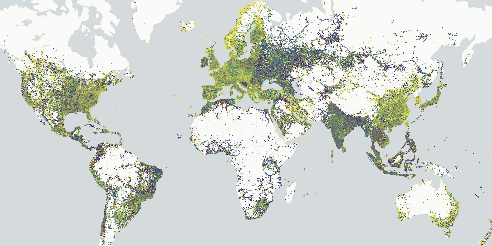

# Overview

This module provides deck.gl layers that accept Apache Arrow and [GeoArrow](https://geoarrow.org) tables. 
These layers take advantage of the deck.gl [low-level binary interface](https://deck.gl/docs/developer-guide/performance#supply-attributes-directly) to provide binary arrow data from Apache Arrow tables directly to the GPU.

:::danger
The deck.gl-community repo is specifically set up to collect useful code that no longer has dedicated maintainers. This means that there is often no one who can respond quickly to issues. The vis.gl / Open Visualization team members who try to keep this running can only put a few hours into it every now and then. It is important to understand this limitation. If your project depends on timely fixes, and you are not able to contribute them yourself, deck.gl-community modules may not be the right choice for you.
:::

:::danger
The arrow layers module is still in the process of being ported into deck.gl-community from [geoarrow/deck.gl-layers](https://github.com/geoarrow/deck.gl-layers).
:::

3.2 million points rendered with a <code>GeoArrowScatterplotLayer</code>.

## Features

- **Fast**: copies binary buffers directly from an [Arrow JS](https://www.npmjs.com/package/apache-arrow) [`Table`](https://arrow.apache.org/docs/js/classes/Arrow_dom.Table.html) object to the GPU using [deck.gl's binary data interface](https://deck.gl/docs/developer-guide/performance#supply-attributes-directly).
- **Memory-efficient**: no intermediate data representation and no garbage-collector overhead.
- **Full layer customization**: Use the same layer properties as in the upstream deck.gl layer documentation. Any _accessor_ (layer property prefixed with `get*`) can be passed an Arrow [`Vector`](https://arrow.apache.org/docs/js/classes/Arrow_dom.Vector.html).
- **Input validation**. Validation can be turned off via the `_validate` property on most layer types.
- **Multi-threaded polygon triangulation**. When rendering polygon layers, a process called [polygon triangulation](https://en.wikipedia.org/wiki/Polygon_triangulation) must happen on the CPU before data can be copied to the GPU. Ordinarily, this can block the main thread for several seconds, but the `GeoArrowSolidPolygonLayer` will perform this process off the main thread, on up to 8 web workers.
- **Progressive rendering support**. For streaming-capable data formats like Arrow IPC and Parquet, you can render a GeoArrow layer per chunk as the data loads.

## Examples

Standalone examples exist in the `examples/arrow-layers` directory. Create an issue if you have trouble running them.

## History

This module is based on the [geoarrow/deck.gl-layers](https://github.com/geoarrow/deck.gl-layers) module, originally developed by Kyle Barron as part of his independent multi-prong effort to implement fully optimized GeoArrow and GeoParquet based browser visualizations. 

It was agreed that the deck.gl-community repository is a good long-term home for this particular module. Of note is that there is also interest to bring Apache Arrow support into the deck.gl core repository in a future release and therefore moving development of these layers closer to deck.gl will reduce the risk of duplicated work.
