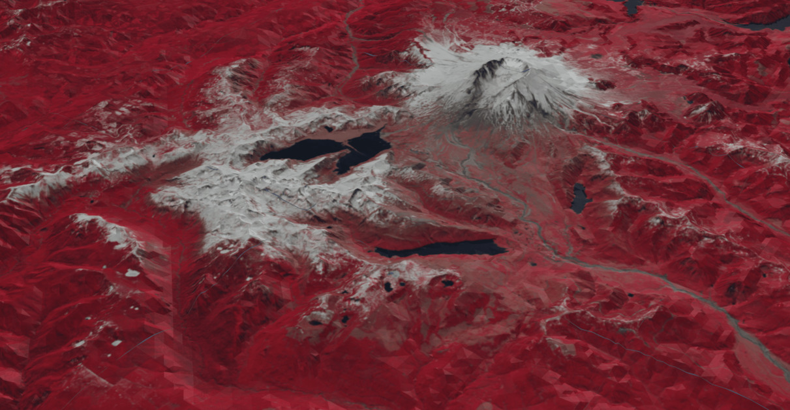

# `RasterMeshLayer`

Landsat infrared false-color composite of Mt. St. Helens.

## Overview

The `RasterMeshLayer` is a subclass of deck.gl's built-in `SimpleMeshLayer` that
enables image operations on satellite image bands, _overlaid onto 3D terrain_.
All image operations are done on the GPU for best performance.

You can combine RGB bands in true color or false color manners, or create a
spectral index and apply a colormap. With true color imagery, you can apply
pansharpening from a panchromatic band. If an operation hasn't been implemented
yet, it's relatively easy to add your own operations.

## Props

#### `modules`

See [RasterLayer `modules`](../raster-layer#modules) for documentation.

#### `images`

See [RasterLayer `images`](../raster-layer#images) for documentation.

#### `moduleProps`

See [RasterLayer `moduleProps`](../raster-layer#moduleProps) for documentation.

#### SimpleMeshLayer Props

This layer inherits [all props][simplemeshlayer_props] from the built-in deck.gl
`SimpleMeshLayer`. E.g. provide the terrain object through the `mesh` prop. The
`SimpleMeshLayer`'s `texture` prop is replaced by the above custom props.

[simplemeshlayer_props]: https://deck.gl/docs/api-reference/mesh-layers/simple-mesh-layer
