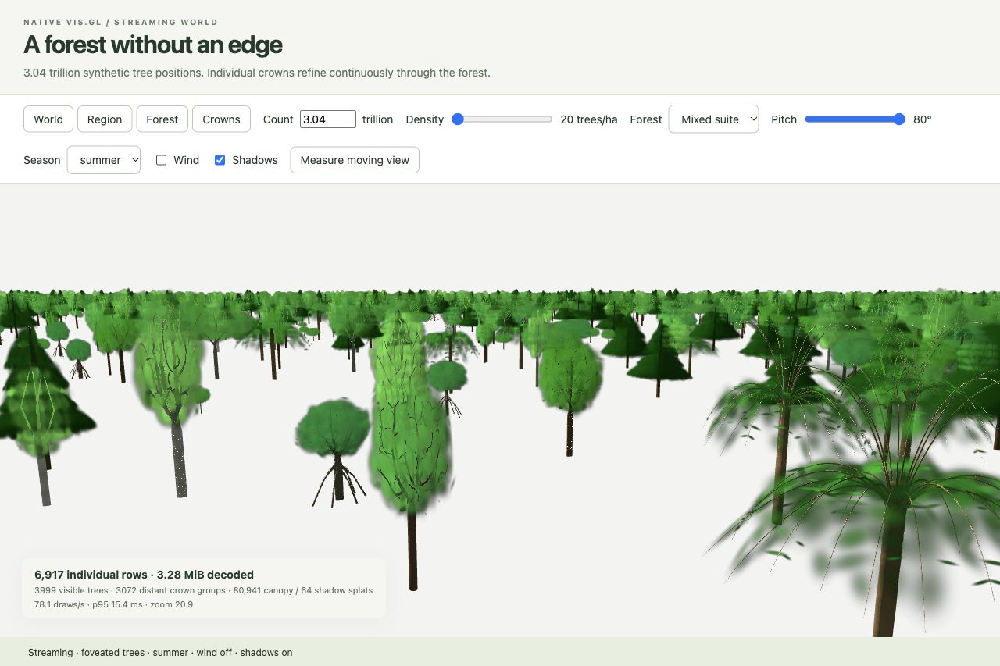

# Forest performance and stability

The 20K moving forest delivers about 51 draws/s in the retained pre-consolidation run (`ba091e9b`), versus about 15.3 on parent commit `1239093b`. It does **not** consistently reach 60 fps. World-scale cardinality stays outside the render loop: only bounded source pages, visible owners and selected Gaussian templates are resident. The synthetic 3.04 trillion count is an address space, not trillions of GPU instances.

## Recorded workload

October 6, 2026, Apple M4 Pro, Metal-backed WebGL2 in the Codex in-app browser. One moving renderer, 587×680 at 1×, eight mixed species, summer, wind and shadows on, crops off. Two-second warmup followed by three five-second samples: 40m flyover plus 90° camera orbit. Other lab animation was paused. Parent measurements were captured earlier the same day with this viewport and workload; the preserved parent's renderer source was unchanged.

| Renderer snapshot | Draws/s, three samples | p95 interval | Render-call p95 | Long tasks |
| --- | --- | --- | --- | --- |
| Parent, 20K | 15.16 / 15.33 / 15.35 | 75.0–75.4 ms | 16.5–16.8 ms | 73–75 |
| `ba091e9b`, 20K | 51.03 / 50.86 / 50.95 | 25.1–25.2 ms | 12.1–12.3 ms | 1 each |
| `ba091e9b`, 10K, stalled run | 49.10 / 33.67 / 1.01 | 25.6 / 83.6 / 2608.4 ms | 12.5 / 32.5 / 697.4 ms | 2 / 25 / 6 |

The 10K run is not a clean scaling comparison: its final 500ms idle timer took 5844ms before measurement. A subsequent host snapshot showed active simulator diagnostics, rendering and WindowServer work. Their contribution was not isolated, so this remains an unresolved scheduling/stall observation, not evidence that 10K is intrinsically slower. All samples are retained in [the measurement data](./performance/2026-10-06.json), including the stalled ones.

These are browser draw delivery and synchronous CPU wall times, not GPU execution or presented-frame counts. Opt-in timestamp profiling is separate. Earlier contaminated multi-renderer samples are excluded. No universal 60 fps claim follows from this run.

## What changed

- Persistent spatial indices and common-position caches avoid rebuilding tree geometry on camera-only updates. Light-space wood lists are selected independently.
- Per-crown foveation and error/cost allocation bound Gaussian work. Finest authored leaves remain available; submitted distant detail is reduced. Current 20K samples select about 203–205K camera Gaussians versus 1.34M in the parent. This is a quality/work allocation improvement, not identical vertex throughput.
- Stable membership uses coalesced buffer ranges. Coverage-only fades reuse transforms and cached wind phases. Fade groups advance once per draw.
- Covariance aggregates retain optical density. LOD and source replacement keep interrupted mixtures, reserve overlap capacity and retire old work gradually.
- Raster resolution stays fixed while geometry budgets adapt. Off-axis projection and eye-crossing covariance are bounded. Authored normals no longer flip toward the camera.
- Connected wood retains physical trunk radii and taper; its coverage pattern is anchored in tree coordinates. The world demo has no ground plane and skips planar shadow transmission/filtering.

WebGL regressions exercise forced quota fades, settled pixel equality, tiny camera changes, grazing-angle lighting, owner picking, source identity and receiver removal/restoration. The original grazing-normal shader fails the new pixel test; the corrected shader passes.

## Limits and reproduction

Run `native.html?renderer=native&count=20000&species=mixed&wind=1&shadows=1&season=summer&view=canopy&motion=flyover&width=587&height=680`, keep the page focused, pause other renderers and select **Run three samples**. Use `count=10000` for the smaller workload. Add `profile=1` only for diagnostic CPU/GPU attribution.

The dense geographic world has a different workload, including loading and source replacement. A close mixed-world orbit at 80° pitch delivered about 31 draws/s in the latest check, with 64ms p95; it does not establish consistent 60 fps. Dense rainforest, larger viewports and long-duration sessions need further profiling. Gaussian color compositing and coarse silhouettes remain approximations; these are procedural trees, not trained photographic assets. Without a ground receiver, the world's shadow toggle retains opaque wood self-shadowing; the planar canopy shadow path is skipped.

These measurements precede the core API and review repairs in the consolidated stack; they are historical evidence, not fresh measurements of this branch.
